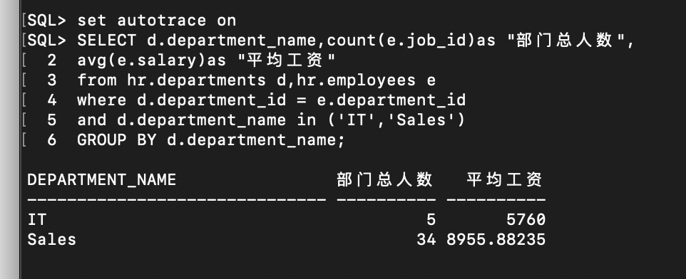
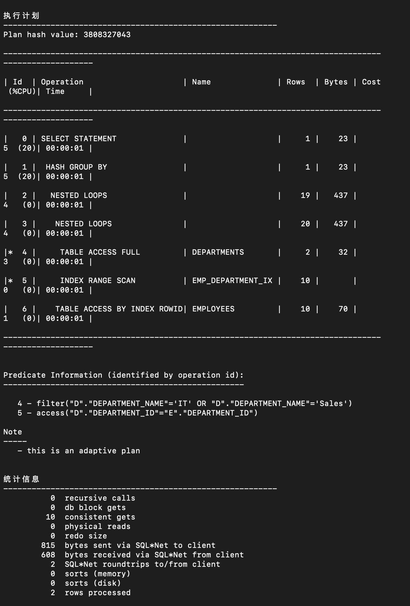

## 连接并运行查询

## 	查询一：

```sql
set autotrace on

SELECT d.department_name,count(e.job_id)as "部门总人数",
avg(e.salary)as "平均工资"
from hr.departments d,hr.employees e
where d.department_id = e.department_id
and d.department_name in ('IT','Sales')
GROUP BY d.department_name;
```

### 			查询结果：

​						

### 			分析结果：

​						

### 			解析：

​						我们从oracle分析结果中能够看出，他为我们提出了两条优化建议： 