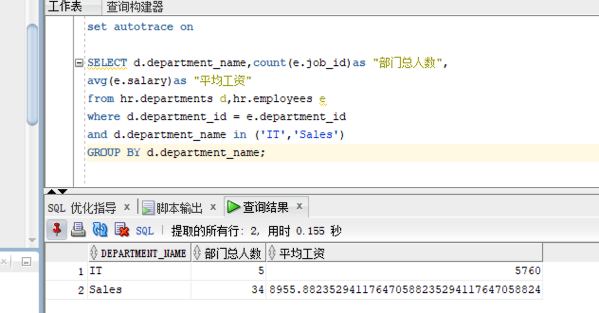
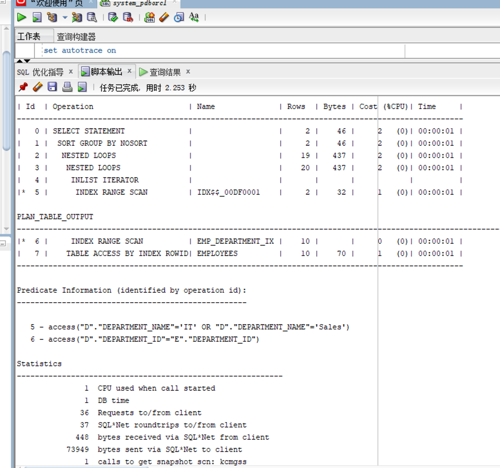
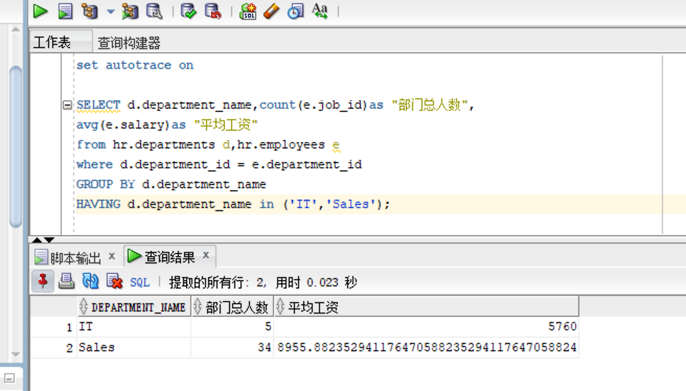
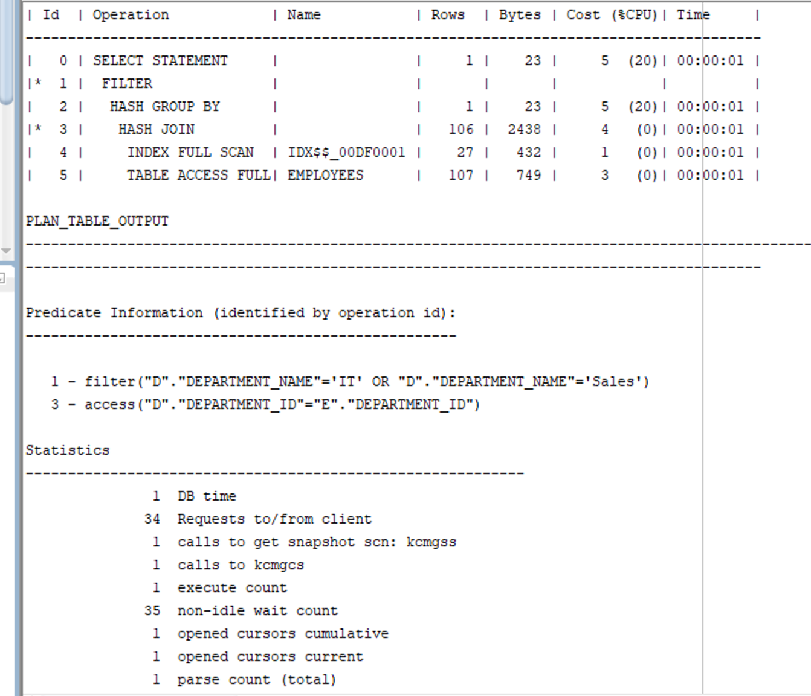
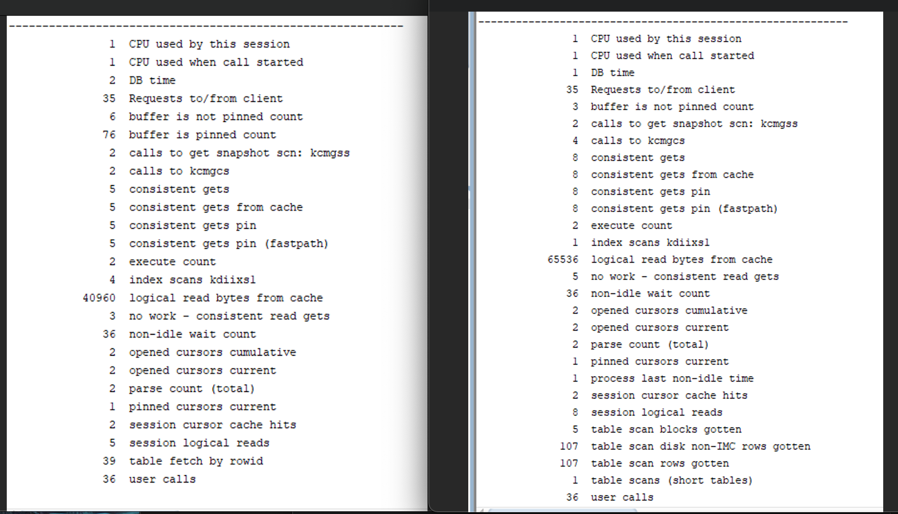

## 1、 实验目的

-  熟悉sql developer的使用
-  分析SQL执行计划，执行SQL语句的优化指导。


## 2、 实验步骤

- 对Oracle12c中的HR人力资源管理系统中的表进行查询与分析。
- 首先运行和分析教材中的样例：本训练任务目的是查询两个部门('IT'和'Sales')的部门总人数和平均工资，以下两个查询的结果是一样的。但效率不相同。
- 设计自己的查询语句，并作相应的分析，查询语句不能太简单。


## 3、 实验步骤

1. #### 使用sql developer执行第一个查询

```sql
set autotrace on

SELECT d.department_name,count(e.job_id)as "部门总人数",
avg(e.salary)as "平均工资"
from hr.departments d,hr.employees e
where d.department_id = e.department_id
and d.department_name in ('IT','Sales')
GROUP BY d.department_name;
```

2. #### 查询结果





3. #### 分析第一个查询

   我们可以看到嵌套循环影响行为20行，cpu消耗为2%，执行了两次索引搜索。 我们执行sql developer的SQL优化指导，能够看到提示没有能够提高查询语句的建议。

   

   

4. #### 使用sql developer执行第二个查询

```sql
set autotrace on

SELECT d.department_name,count(e.job_id)as "部门总人数",
avg(e.salary)as "平均工资"
from hr.departments d,hr.employees e
where d.department_id = e.department_id
GROUP BY d.department_name
HAVING d.department_name in ('IT','Sales');
```

5. #### 查询结果

​						



6. #### 分析第二个查询

   从输出脚本中能够看到，使用了hash join， 影响行数为106行，cpu消耗为5%，执行了一次索引搜索和一次全表搜索。

   

   

7. #### 比较两个查询

   我们先查看两种不同的查询详细参数：

   

   可以看到查询一的参数大体较查询二更好，虽然查询二使用了hash join来代替nested-loop join，提高效率。但是他的having子句导致了查询2总是先进行having过滤再进行group汇总，导致效率低下。 因此综合来说查询一的效率会更高，并且也能看到查询一的cpu占用情况也确实较查询二更好。

   

8. #### 自己编写的查询语句

```sql
SELECT d.department_name,count(e.job_id)as "部门总人数",
avg(e.salary)as "平均工资"
from (select * from hr.departments where department_name in ('IT','Sales')) d,hr.employees e
where d.department_id = e.department_id
GROUP BY d.department_name;
```

​	对所有的departments数据进行预处理，挑选出符合要求的数据再进行连接和运算，能够减少参加连接运算的数据量，优化查询效率。