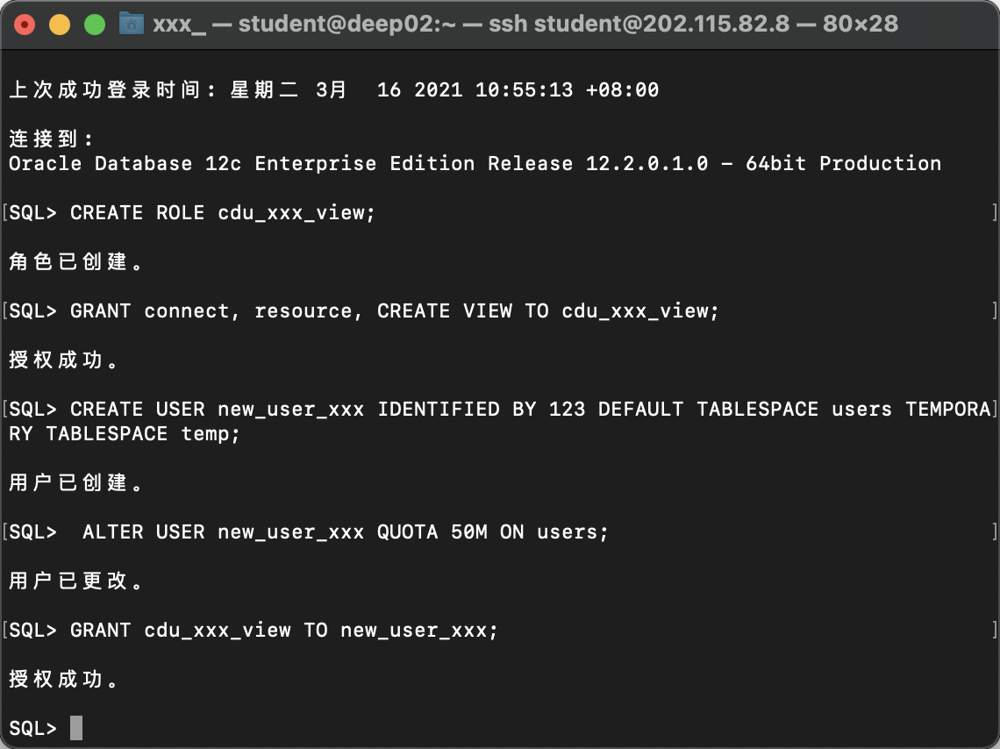
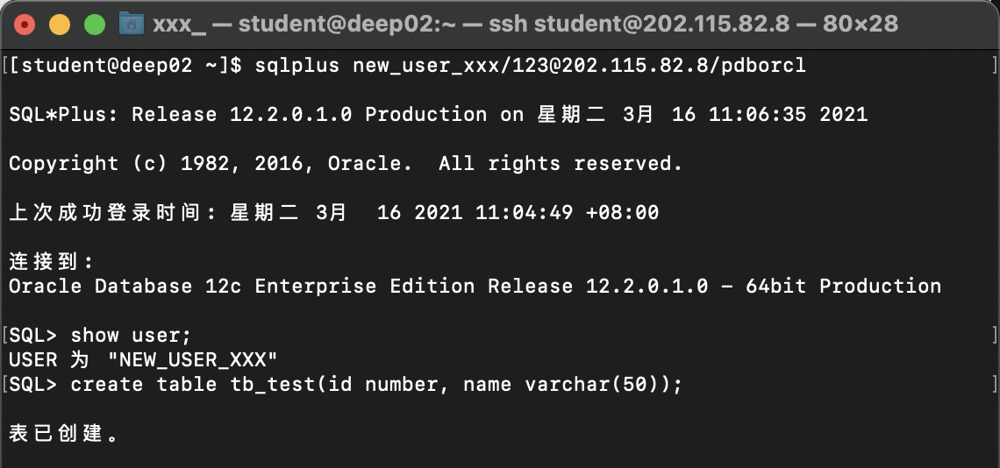
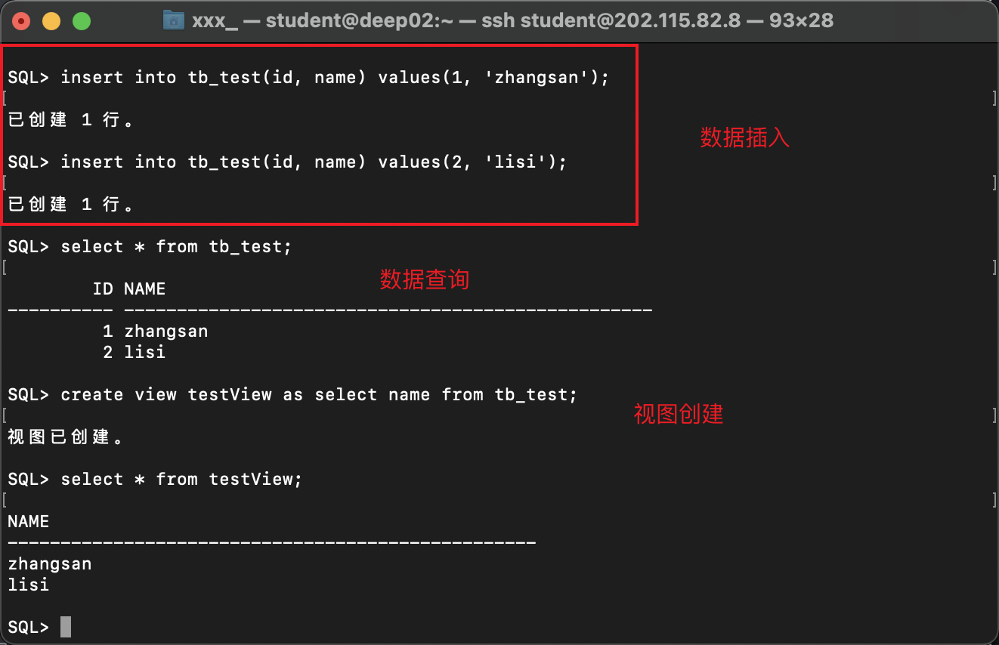
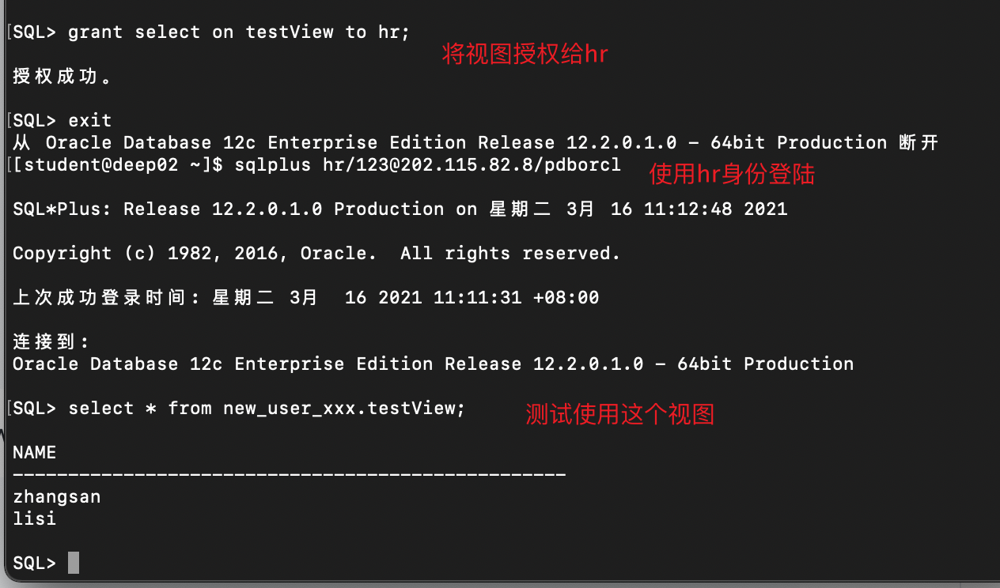
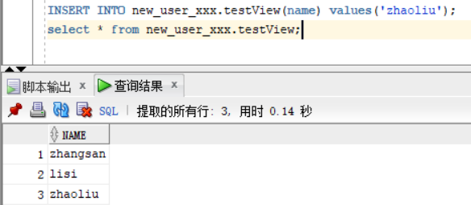
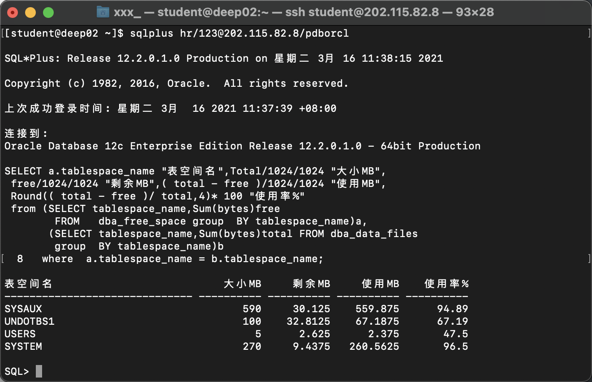

## 实验2：用户及权限管理

### 实验目的

掌握用户管理、角色管理、权根维护与分配的能力，掌握用户之间共享对象的操作技能。


### 实验内容

Oracle有一个开发者角色resource，可以创建表、过程、触发器等对象，但是不能创建视图。本训练要求：

- 在pdborcl插接式数据中创建一个新的本地角色**cdu_xxx_view**，该角色包含connect和resource角色，同时也包含CREATE VIEW权限，这样任何拥有**cdu_xxx_view**的用户就同时拥有这三种权限。
- 创建角色之后，再创建用户**new_user_xxx**，给用户分配表空间，设置限额为50M，授予**cdu_xxx_view**角色。
- 最后测试：用新用户**new_user_xxx**连接数据库、创建表，插入数据，创建视图，查询表和视图的数据。


### 实验步骤

1、 以system身份登陆到pdborcl上，创建角色**cdu_xxx_view**， 并给他授权connect、resource和create view权限， 随后创建用户**new_user_xxx**， 给他授予**cdu_xxx_view**角色，并且设置他可操作users表的表空间为最大50M：

```sql
SQL> CREATE ROLE cdu_xxx_view;

角色已创建。

SQL> GRANT connect, resource, CREATE VIEW TO cdu_xxx_view;

授权成功。

SQL> CREATE USER new_user_xxx IDENTIFIED BY 123 DEFAULT TABLESPACE users TEMPORARY TABLESPACE temp;

用户已创建。

SQL>  ALTER USER new_user_xxx QUOTA 50M ON users;

用户已更改。

SQL> GRANT cdu_xxx_view TO new_user_xxx;

授权成功。
```




2、 使用新建的用户（**new_user_xxx**）登陆，并且创建一个测试表：

```sql
[student@deep02 ~]$ sqlplus new_user_xxx/123@202.115.82.8/pdborcl

SQL*Plus: Release 12.2.0.1.0 Production on 星期二 3月 16 11:06:35 2021

Copyright (c) 1982, 2016, Oracle.  All rights reserved.

上次成功登录时间: 星期二 3月  16 2021 11:04:49 +08:00

连接到: 
Oracle Database 12c Enterprise Edition Release 12.2.0.1.0 - 64bit Production

SQL> show user;
USER 为 "NEW_USER_XXX"
SQL> create table tb_test(id number, name varchar(50));

表已创建。
```




3、 使用**new_user_xxx**测试数据的插入、数据的查询、视图的创建

```sql
SQL> show user;
USER 为 "NEW_USER_XXX"
SQL> create table tb_test(id number, name varchar(50));

表已创建。

SQL> insert into tb_test(id, name) values(1, 'zhangsan');

已创建 1 行。

SQL> insert into tb_test(id, name) values(2, 'lisi');

已创建 1 行。

SQL> select * from tb_test;

	ID NAME
---------- --------------------------------------------------
	 1 zhangsan
	 2 lisi

SQL> create view testView as select name from tb_test;

视图已创建。

SQL> select * from testView;

NAME
--------------------------------------------------
zhangsan
lisi
```




4、 测试**new_user_xxx**用户视图的授权 以及 被授权用户视图的使用

```sql
SQL> grant select on testView to hr;

授权成功。

SQL> exit
从 Oracle Database 12c Enterprise Edition Release 12.2.0.1.0 - 64bit Production 断开
[student@deep02 ~]$ sqlplus hr/123@202.115.82.8/pdborcl

SQL*Plus: Release 12.2.0.1.0 Production on 星期二 3月 16 11:12:48 2021

Copyright (c) 1982, 2016, Oracle.  All rights reserved.

上次成功登录时间: 星期二 3月  16 2021 11:11:31 +08:00

连接到: 
Oracle Database 12c Enterprise Edition Release 12.2.0.1.0 - 64bit Production

SQL> select * from new_user_xxx.testView;

NAME
--------------------------------------------------
zhangsan
lisi
```

 


5、 授权读写权限给同学， 测试数据的读写：

```sql
SQL> grant select, insert on testView to fourteen;

授权成功。
```

​	

​	同学的测试结果：




6、 简单查看数据库文件磁盘的占用情况：

```sql
[student@deep02 ~]$ sqlplus hr/123@202.115.82.8/pdborcl

SQL*Plus: Release 12.2.0.1.0 Production on 星期二 3月 16 11:38:15 2021

Copyright (c) 1982, 2016, Oracle.  All rights reserved.

上次成功登录时间: 星期二 3月  16 2021 11:37:39 +08:00

连接到: 
Oracle Database 12c Enterprise Edition Release 12.2.0.1.0 - 64bit Production

SELECT a.tablespace_name "表空间名",Total/1024/1024 "大小MB",
 free/1024/1024 "剩余MB",( total - free )/1024/1024 "使用MB",
 Round(( total - free )/ total,4)* 100 "使用率%"
 from (SELECT tablespace_name,Sum(bytes)free
        FROM   dba_free_space group  BY tablespace_name)a,
       (SELECT tablespace_name,Sum(bytes)total FROM dba_data_files
        group  BY tablespace_name)b
  8   where  a.tablespace_name = b.tablespace_name;

表空间名                           大小MB     剩余MB     使用MB    使用率%
------------------------------ ---------- ---------- ---------- ----------
SYSAUX				      						590     		30.125		559.875      94.89
UNDOTBS1			      						100    			32.8125		67.1875      67.19
USERS														5      			2.625	  	2.375        47.5
SYSTEM				      						270     		9.4375   	260.5625     96.5
```




