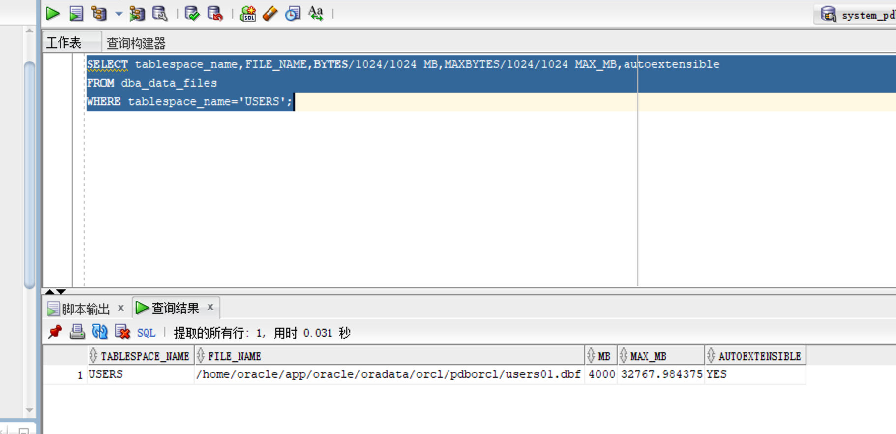

# 实验3：创建分区表

## 实验目的

掌握分区表的创建方法，掌握各种分区方式的使用场景。

## 实验内容

- 本实验使用3个表空间：USERS,USERS02,USERS03。在表空间中创建两张表：订单表(orders)与订单详表(order_details)。
- 使用**你自己的账号创建本实验的表**，表创建在上述3个分区，自定义分区策略。
- 你需要使用system用户给你自己的账号分配上述分区的使用权限。你需要使用system用户给你的用户分配可以查询执行计划的权限。
- 表创建成功后，插入数据，数据能并平均分布到各个分区。每个表的数据都应该大于1万行，对表进行联合查询。
- 写出插入数据的语句和查询数据的语句，并分析语句的执行计划。
- 进行分区与不分区的对比实验。

## 实验步骤

1. 登陆system并给自己创建的用户（new_user_xxx）授权表空间


2. 登陆自己创建的用户


3. 执行PL/SQL过程体 

```sql
declare
      num   number;
begin
      select count(1) into num from user_tables where TABLE_NAME = 'ORDER_DETAILS';
      if   num=1   then
          execute immediate 'drop table ORDER_DETAILS cascade constraints PURGE';
      end   if;

      select count(1) into num from user_tables where TABLE_NAME = 'ORDERS';
      if   num=1   then
          execute immediate 'drop table ORDERS cascade constraints PURGE';
      end   if;
end;
```


4. 创建orders表

```sql
CREATE TABLE orders (
    order_id          NUMBER(10, 0) NOT NULL,
    customer_name     VARCHAR2(40 BYTE) NOT NULL,
    customer_tel      VARCHAR2(40 BYTE) NOT NULL,
    order_date        DATE NOT NULL,
    employee_id       NUMBER(6, 0) NOT NULL,
    discount          NUMBER(8, 2) DEFAULT 0,
    trade_receivable  NUMBER(8, 2) DEFAULT 0,
    CONSTRAINT orders_pk PRIMARY KEY ( order_id )
        USING INDEX (
            CREATE UNIQUE INDEX orders_pk ON
                orders (
                    order_id
                ASC )
                    LOGGING TABLESPACE users PCTFREE 10 INITRANS 2
                        STORAGE ( BUFFER_POOL DEFAULT )
                        NOPARALLEL
        )
    ENABLE
)
TABLESPACE users PCTFREE 10 INITRANS 1
    STORAGE ( BUFFER_POOL DEFAULT )
NOCOMPRESS
        NOPARALLEL
        PARTITION BY RANGE (
            order_date
        )
        ( PARTITION partition_2015
            VALUES LESS THAN ( to_date(' 2016-01-01 00:00:00', 'SYYYY-MM-DD HH24:MI:SS', 'NLS_CALENDAR=GREGORIAN') )
        NOLOGGING TABLESPACE users PCTFREE 10 INITRANS 1
            STORAGE ( INITIAL 8388608 NEXT 1048576 MINEXTENTS 1 MAXEXTENTS UNLIMITED BUFFER_POOL DEFAULT )
        NOCOMPRESS NO INMEMORY,
        PARTITION partition_2016
            VALUES LESS THAN ( to_date(' 2017-01-01 00:00:00', 'SYYYY-MM-DD HH24:MI:SS', 'NLS_CALENDAR=GREGORIAN') )
        NOLOGGING TABLESPACE users PCTFREE 10 INITRANS 1
            STORAGE ( BUFFER_POOL DEFAULT )
        NOCOMPRESS NO INMEMORY,
        PARTITION partition_2017
            VALUES LESS THAN ( to_date(' 2018-01-01 00:00:00', 'SYYYY-MM-DD HH24:MI:SS', 'NLS_CALENDAR=GREGORIAN') )
        NOLOGGING TABLESPACE users PCTFREE 10 INITRANS 1
            STORAGE ( BUFFER_POOL DEFAULT )
        NOCOMPRESS NO INMEMORY,
        PARTITION partition_2018
            VALUES LESS THAN ( to_date(' 2019-01-01 00:00:00', 'SYYYY-MM-DD HH24:MI:SS', 'NLS_CALENDAR=GREGORIAN') )
        NOLOGGING TABLESPACE users02 PCTFREE 10 INITRANS 1
            STORAGE ( BUFFER_POOL DEFAULT )
        NOCOMPRESS NO INMEMORY,
        PARTITION partition_2019
            VALUES LESS THAN ( to_date(' 2020-01-01 00:00:00', 'SYYYY-MM-DD HH24:MI:SS', 'NLS_CALENDAR=GREGORIAN') )
        NOLOGGING TABLESPACE users02 PCTFREE 10 INITRANS 1
            STORAGE ( BUFFER_POOL DEFAULT )
        NOCOMPRESS NO INMEMORY,
        PARTITION partition_2020
            VALUES LESS THAN ( to_date(' 2021-01-01 00:00:00', 'SYYYY-MM-DD HH24:MI:SS', 'NLS_CALENDAR=GREGORIAN') )
        NOLOGGING TABLESPACE users02 PCTFREE 10 INITRANS 1
            STORAGE ( BUFFER_POOL DEFAULT )
        NOCOMPRESS NO INMEMORY,
        PARTITION partition_2021
            VALUES LESS THAN ( to_date(' 2022-01-01 00:00:00', 'SYYYY-MM-DD HH24:MI:SS', 'NLS_CALENDAR=GREGORIAN') )
        NOLOGGING TABLESPACE users03 PCTFREE 10 INITRANS 1
            STORAGE ( BUFFER_POOL DEFAULT )
        NOCOMPRESS NO INMEMORY );
```


5. 创建ORDER_DETAILS

```sql
CREATE TABLE order_details
(
	id NUMBER(10, 0) NOT NULL
	, order_id NUMBER(10, 0) NOT NULL
	, product_name VARCHAR2(40 BYTE) NOT NULL
	, product_num NUMBER(8, 2) NOT NULL
	, product_price NUMBER(8, 2) NOT NULL
	, CONSTRAINT order_details_fk1 FOREIGN KEY  (order_id)
	REFERENCES orders  (  order_id   )
	ENABLE
)
TABLESPACE USERS
PCTFREE 10 INITRANS 1
STORAGE (BUFFER_POOL DEFAULT )
NOCOMPRESS NOPARALLEL
PARTITION BY REFERENCE (order_details_fk1);
```


6. 使用定义的过程体插入数据

```sql
declare
  dt date;
  m number(8,2);
  V_EMPLOYEE_ID NUMBER(6);
  v_order_id number(10);
  v_name varchar2(100);
  v_tel varchar2(100);
  v number(10,2);
  v_order_detail_id number;
begin
  v_order_detail_id:=1;
  delete from order_details;
  delete from orders;
  for i in 1..10000
  loop
    if i mod 6 =0 then
      dt:=to_date('2015-3-2','yyyy-mm-dd')+(i mod 60); --PARTITION_2015
    elsif i mod 6 =1 then
      dt:=to_date('2016-3-2','yyyy-mm-dd')+(i mod 60); --PARTITION_2016
    elsif i mod 6 =2 then
      dt:=to_date('2017-3-2','yyyy-mm-dd')+(i mod 60); --PARTITION_2017
    elsif i mod 6 =3 then
      dt:=to_date('2018-3-2','yyyy-mm-dd')+(i mod 60); --PARTITION_2018
    elsif i mod 6 =4 then
      dt:=to_date('2019-3-2','yyyy-mm-dd')+(i mod 60); --PARTITION_2019
    else
      dt:=to_date('2020-3-2','yyyy-mm-dd')+(i mod 60); --PARTITION_2020
    end if;
    V_EMPLOYEE_ID:=CASE I MOD 6 WHEN 0 THEN 11 WHEN 1 THEN 111 WHEN 2 THEN 112
                                WHEN 3 THEN 12 WHEN 4 THEN 121 ELSE 122 END;
	
    v_order_id:=i;
    v_name := 'aa'|| 'aa';
    v_name := 'zhang' || i;
    v_tel := '139888883' || i;
    insert /*+append*/ into ORDERS (ORDER_ID,CUSTOMER_NAME,CUSTOMER_TEL,ORDER_DATE,EMPLOYEE_ID,DISCOUNT)
      values (v_order_id,v_name,v_tel,dt,V_EMPLOYEE_ID,dbms_random.value(100,0));
	
    v:=dbms_random.value(10000,4000);
    v_name:='computer'|| (i mod 3 + 1);
    insert /*+append*/ into ORDER_DETAILS(ID,ORDER_ID,PRODUCT_NAME,PRODUCT_NUM,PRODUCT_PRICE)
      values (v_order_detail_id,v_order_id,v_name,2,v);
    v:=dbms_random.value(1000,50);
    v_name:='paper'|| (i mod 3 + 1);
    v_order_detail_id:=v_order_detail_id+1;
    insert /*+append*/ into ORDER_DETAILS(ID,ORDER_ID,PRODUCT_NAME,PRODUCT_NUM,PRODUCT_PRICE)
      values (v_order_detail_id,v_order_id,v_name,3,v);
    v:=dbms_random.value(9000,2000);
    v_name:='phone'|| (i mod 3 + 1);

    v_order_detail_id:=v_order_detail_id+1;
    insert /*+append*/ into ORDER_DETAILS(ID,ORDER_ID,PRODUCT_NAME,PRODUCT_NUM,PRODUCT_PRICE)
      values (v_order_detail_id,v_order_id,v_name,1,v);
	
    select sum(PRODUCT_NUM*PRODUCT_PRICE) into m from ORDER_DETAILS where ORDER_ID=v_order_id;
    if m is null then
     m:=0;
    end if;
    UPDATE ORDERS SET TRADE_RECEIVABLE = m - discount WHERE ORDER_ID=v_order_id;
    IF I MOD 1000 =0 THEN
      commit; 
    END IF;
  end loop;
end;
```


7. 使用system身份进行数据查看

```sql
set autotrace on

select * from new_user_xxx.orders where order_date
between to_date('2017-1-1','yyyy-mm-dd') and to_date('2018-6-1','yyyy-mm-dd');

select a.ORDER_ID,a.CUSTOMER_NAME,
b.product_name,b.product_num,b.product_price
from new_user_xxx.orders a,new_user_xxx.order_details b where
a.ORDER_ID=b.order_id and
a.order_date between to_date('2017-1-1','yyyy-mm-dd') and to_date('2018-6-1','yyyy-mm-dd');
```


## 查看数据库的使用情况

```sql
SELECT tablespace_name,FILE_NAME,BYTES/1024/1024 MB,MAXBYTES/1024/1024 MAX_MB,autoextensible
FROM dba_data_files  
WHERE tablespace_name='USERS';
```



```sql
SELECT a.tablespace_name "表空间名",Total/1024/1024 "大小MB",
 free/1024/1024 "剩余MB",( total - free )/1024/1024 "使用MB",
 Round(( total - free )/ total,4)* 100 "使用率%"
 from (SELECT tablespace_name,Sum(bytes)free
        FROM   dba_free_space group  BY tablespace_name)a,
       (SELECT tablespace_name,Sum(bytes)total FROM dba_data_files
        group  BY tablespace_name)b
 where  a.tablespace_name = b.tablespace_name;
```


