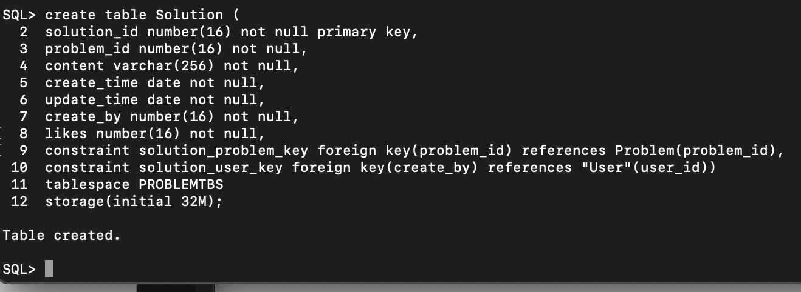

# ·实验6（期末考核） 基于Oracle的OnlineJudge系统的数据库设计


## 1、表空间创建

```sh
SQL> create tablespace USERTBS
2  datafile './USERTBS.DBF' size 64M;

Tablespace created.

SQL> create tablespace PROBLEMTBS
2  datafile './PROBLEMTBS.DBF' size 128M;

Tablespace created.
```


## 2、 数据库创建





## 3、模拟数据插入

```sql
DECLARE random_num int;
	random_day int; 
	random_hour int; 
	random_minu int; 
	random_sec int;
begin
	for i in 1..5
	loop
		select trunc(dbms_random.value(10,28))into random_day FROM dual;
		select trunc(dbms_random.value(1,24))into random_hour FROM dual;
		select trunc(dbms_random.value(1,60))into random_minu FROM dual;
		select trunc(dbms_random.value(1,60))into random_sec FROM dual;
		insert into "Sys_user" values(i, 
                  '超级管理员' || i, 
                  '123'||random_day||random_hour||random_minu||random_sec,
                  '123'||random_day||random_hour||random_minu||random_sec,
                  to_date('2021-06-'||random_day||' '||random_hour||':'||random_minu||':'||random_sec,'yyyy-mm-dd hh24:mi:ss'),
                  0, 1, 1);
		commit; 
	end loop;


	for i in 6..20 
	loop
		select trunc(dbms_random.value(1,5))into random_num FROM dual; -- 随机生成“父级”id
		select trunc(dbms_random.value(10,28))into random_day FROM dual;
		select trunc(dbms_random.value(1,24))into random_hour FROM dual;
		select trunc(dbms_random.value(1,60))into random_minu FROM dual;
		select trunc(dbms_random.value(1,60))into random_sec FROM dual;
		insert into "Sys_user" values(i, 
                  '超级管理员' || i, 
                  '123'||random_day||random_hour||random_minu||random_sec,
                  '123'||random_day||random_hour||random_minu||random_sec,
                  to_date('2021-06-'||random_day||' '||random_hour||':'||random_minu||':'||random_sec,'yyyy-mm-dd hh24:mi:ss'),
                  random_num, 1, 1);
	end loop;
end;
```


生成数据：


```sql

DECLARE random_day int;
	random_hour int; 
	random_minu int; 
	random_sec int; 
	random_tel varchar(11);
	
begin
	for i in 1..5000
	loop
		select trunc(dbms_random.value(10,28))into random_day FROM dual;
		select trunc(dbms_random.value(1,24))into random_hour FROM dual;
		select trunc(dbms_random.value(1,60))into random_minu FROM dual;
		select trunc(dbms_random.value(1,60))into random_sec FROM dual;
		select rpad('139'||random_day||random_hour||random_minu||random_sec,'11','0') INTO random_tel from dual;
		
		insert into "User" values(i, 'user' || i, '用户' || i,
             '242'||random_day||random_hour||random_minu||random_sec||'@qq.com',
             random_tel,
             '男',
             '242'||random_day||random_hour||random_minu||random_sec,
             'ewr'||random_day||random_hour||random_minu||random_sec,
             to_date('2021-06-'||random_day||' '||random_hour||':'||random_minu||':'||random_sec,'yyyy-mm-dd hh24:mi:ss'), 1);
		
		commit;
	end loop;
end;
```


生成数据: 


```sql
DECLARE random_day int;
	random_hour int; 
	random_minu int; 
	random_sec int; 
	random_by int; 
	random_likes int; 
	random_try int; 
	random_pass int;
	
begin
	for i in 1..10000
	loop
		select trunc(dbms_random.value(10,28))into random_day FROM dual;
		select trunc(dbms_random.value(1,24))into random_hour FROM dual;
		select trunc(dbms_random.value(1,60))into random_minu FROM dual;
		select trunc(dbms_random.value(1,60))into random_sec FROM dual; -- 随机生成日时分秒
		select trunc(dbms_random.value(1,5000))into random_by FROM dual;
		select trunc(dbms_random.value(1,5000))into random_likes FROM dual;
		select trunc(dbms_random.value(4000, 20000))into random_try FROM dual;
		select trunc(dbms_random.value(1,4000))into random_pass FROM dual;
		
		insert into "PROBLEM" values(i, '题目' || i, '内容' || i,
         to_date('2021-06-'||random_day||' '||random_hour||':'||random_minu||':'||random_sec,'yyyy-mm-dd hh24:mi:ss'),
         random_by,
         random_likes,
         random_try,
         random_pass);
    commit;
	end loop;
end;
```


生成数据：


其余三张表的数据插入过程如下：

```sql

DECLARE 
	random_day int;
	random_hour int; 
	random_minu int; 
	random_sec int; 
	random_by int; 
	random_id int; 
	random_likes int;
	
begin
	for i in 1..10000
	loop
		select trunc(dbms_random.value(10,28))into random_day FROM dual;
		select trunc(dbms_random.value(1,24))into random_hour FROM dual;
		select trunc(dbms_random.value(1,60))into random_minu FROM dual;
		select trunc(dbms_random.value(1,60))into random_sec FROM dual; -- 随机生成日时分秒
		select trunc(dbms_random.value(1,5000))into random_by FROM dual;
		select trunc(dbms_random.value(1,10000))into random_id FROM dual;
		select trunc(dbms_random.value(1,5000))into random_likes FROM dual;
		
		insert into SOLUTION(SOLUTION_ID, PROBLEM_ID, CONTENT, CREATE_TIME, CREATE_BY, LIKES)
				VALUES(i, random_id, '题解内容' || i,
               to_date('2021-06-'||random_day||' '||random_hour||':'||random_minu||':'||random_sec,'yyyy-mm-dd hh24:mi:ss'),
               random_by, random_likes);
    commit;
  end loop;
end


DECLARE 
	random_day int;
	random_hour int; 
	random_minu int; 
	random_sec int; 
	random_id int;
	
begin
	for i in 1..40000
		select trunc(dbms_random.value(10,28))into random_day FROM dual;
		select trunc(dbms_random.value(1,24))into random_hour FROM dual;
		select trunc(dbms_random.value(1,60))into random_minu FROM dual;
		select trunc(dbms_random.value(1,60))into random_sec FROM dual; -- 随机生成日时分秒
		select trunc(dbms_random.value(1,10000))into random_id FROM dual;
		
		insert into CHECKPOINT VALUES(i, random_id, '检查点' || i,
          to_date('2021-06-'||random_day||' '||random_hour||':'||random_minu||':'||random_sec,'yyyy-mm-dd hh24:mi:ss'));
		commit;
	end loop;
end;


DECLARE 
	random_day int;
	random_hour int; 
	random_minu int; 
	random_sec int; 
	random_solution int; 
	random_by int; 
	random_likes int;

begin
	for i in 1..40000
	loop
		select trunc(dbms_random.value(10,28))into random_day FROM dual;
		select trunc(dbms_random.value(1,24))into random_hour FROM dual;
		select trunc(dbms_random.value(1,60))into random_minu FROM dual;
		select trunc(dbms_random.value(1,60))into random_sec FROM dual; -- 随机生成日时分秒
		select trunc(dbms_random.value(1,10000))into random_solution FROM dual;
		select trunc(dbms_random.value(1,5000))into random_by FROM dual;
		select trunc(dbms_random.value(1,5000))into random_likes FROM dual;
		
		insert into "Comment" VALUES(i, random_solution, '评论' || i,
         to_date('2021-06-'||random_day||' '||random_hour||':'||random_minu||':'||random_sec,'yyyy-mm-dd hh24:mi:ss'),
         random_by, random_likes);
    
    commit;
  end loop;
end;
```

插入的数据如下：


## 4、角色创建及权限分配

```sql
> create user simple idenntified by 123456;

User created.

> grant connect to simple;

Grant succeeded.

> grant select on "User" to simple;

Grant succeeded.

> grant select on "Sys_user" to simple;

Grant succeeded.

> grant select on "Comment" to simple;

Grant succeeded.

> grant select on PROBLEM to simple;

Grant succeeded.

> grant select on SOLUTION to simple;

Grant succeeded.

> grant select on CHECKPOINT to simple;

Grant succeeded.
```

```sql
> create user super idenntified by 123456;

User created.

> grant connect, resource, dba to super;

Grant succeeded.
```


## 5、存储过程

```sql
CREATE OR REPLACE PACKAGE oj_package AS
   PROCEDURE top_user(num_limit NUMBER);
   PROCEDURE top_problem(num_limit NUMBER);
END oj_package;


create or replace procedure top_user(num_limit NUMBER)
as
begin
	delete "Top_user";
	
	INSERT INTO "Top_user"
	SELECT *
	FROM (
		SELECT u.USER_ID USER_ID, u.NICK_NAME NICK_NAME, TOTAL PROBLEM_NUMS
		from "User" u 
		INNER JOIN (
			SELECT CREATE_BY, count(*) total 
			FROM PROBLEM 
			GROUP BY CREATE_BY) c
		ON u.USER_ID = c.CREATE_BY
		WHERE u.STATUS = 1
		ORDER BY c.TOTAL DESC )
	where ROWNUM<=num_limit;
end;
/


create or replace procedure top_problem(num_limit NUMBER)
as
begin
	delete "Top_problem";
	
	INSERT INTO "Top_problem"
	SELECT *
	FROM (
		SELECT p.PROBLEM_ID PROBLEM_ID, TOTAL SOLUTION_NUM
		from PROBLEM p
		INNER JOIN (
			SELECT PROBLEM_ID, count(*) total 
			FROM SOLUTION 
			GROUP BY PROBLEM_ID) c
		ON p.PROBLEM_ID = c.PROBLEM_ID
		ORDER BY c.TOTAL DESC )
	where ROWNUM<=num_limit;
end;
/
```


存储过程调用：


## 6、手动备份

```shell
$ docker ps -a
CONTAINER ID   IMAGE                    COMMAND                  CREATED        STATUS                      PORTS                                                                                  NAMES
1a4ff9e79148   truevoly/oracle-12c      "/entrypoint.sh "        3 days ago     Up 4 hours                  0.0.0.0:1521->1521/tcp, :::1521->1521/tcp, 0.0.0.0:8080->8080/tcp, :::8080->8080/tcp   jovial_hugle


$ docker stop 1a
1a

$ docker commit 1a oracle_bak
sha256: d9c748cd88a2176375ab9b22f194893448e0c5a7952db8bb6f4d84bbede489a9 

$ docker run d9
found files in /u01/app/oracle/oradata Using them instead of initial database
ORACLE instance started.

Total System Global Area		624951296 bytes
Fixed Size 										2927480 bytes
Variable Size								306185352 bytes
Database Buffers 						310378496 bytes
Redo Buffers									5459968 bytes
Database mounted.
Database opened.
Starting web management console

PL/SQL procedure successfully completed.

[IMPORT] Not a first start, SKIPPING Import from Volume ' /docker entrypoint-initdb.d'
[ IMPORT] If you want to enable import at any state - add ' IMPORT_ FROM_ VOLUME=true'variable

Database ready to use. Enjoy! ;)
```

